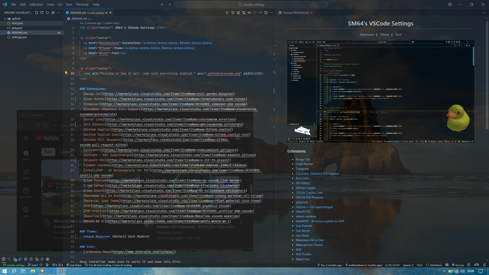

<h1 align="center"> SM64's VSCode Settings </h1>  
  
<p align="center">
  <a href="#extensions">Extensions</a>&nbsp;&nbsp;&nbsp;|&nbsp;&nbsp;&nbsp;  
  <a href="#theme">Theme</a>&nbsp;&nbsp;&nbsp;|&nbsp;&nbsp;&nbsp;  
  <a href="#font">Font</a>
</p>

<p align="center">
  
</p>

### Extensions:
- [Error Lens](https://marketplace.visualstudio.com/items?itemName=usernamehw.errorlens)
- [background](https://marketplace.visualstudio.com/items?itemName=shalldie.background)
- [Bongo Cat](https://marketplace.visualstudio.com/items?itemName=pixl-garden.BongoCat)
- [BongoCat Sidebar](https://marketplace.visualstudio.com/items?itemName=Milynn.bongocat-sidebar)
- [GitLens — Git supercharged](https://marketplace.visualstudio.com/items?itemName=eamodio.gitlens)
- [Live Share](https://marketplace.visualstudio.com/items?itemName=MS-vsliveshare.vsliveshare)
- [Live Preview](https://marketplace.visualstudio.com/items?itemName=ms-vscode.live-server)
- [Live Server](https://marketplace.visualstudio.com/items?itemName=ritwickdey.LiveServer)
- [Material Icon Theme](https://marketplace.visualstudio.com/items?itemName=PKief.material-icon-theme)
- [Node.js Exec](https://marketplace.visualstudio.com/items?itemName=miramac.vscode-exec-node)
- [PHP](https://marketplace.visualstudio.com/items?itemName=DEVSENSE.phptools-vscode)
- [Cucumber (Gherkin) Full Support](https://marketplace.visualstudio.com/items?itemName=alexkrechik.cucumberautocomplete)
- [Composer](https://marketplace.visualstudio.com/items?itemName=DEVSENSE.composer-php-vscode)
- [indent-rainbow](https://marketplace.visualstudio.com/items?itemName=oderwat.indent-rainbow)
- [Where Am I?](https://marketplace.visualstudio.com/items?itemName=antfu.where-am-i)
- [Time](https://marketplace.visualstudio.com/items?itemName=n3rds-inc.time)
- [Open in GitHub](https://marketplace.visualstudio.com/items?itemName=fabiospampinato.vscode-open-in-github)
- [Indenticator](https://marketplace.visualstudio.com/items?itemName=SirTori.indenticator)

### Theme:
- **Dark High Contrast** *Default High Contrast*

### Font:
- [JetBrains Mono](https://www.jetbrains.com/lp/mono/)

Once installed, make sure to unzip it and open this file:  
```JetBrainsMono-2.304/fonts/ttf/JetBrainsMono-Regular.ttf```
