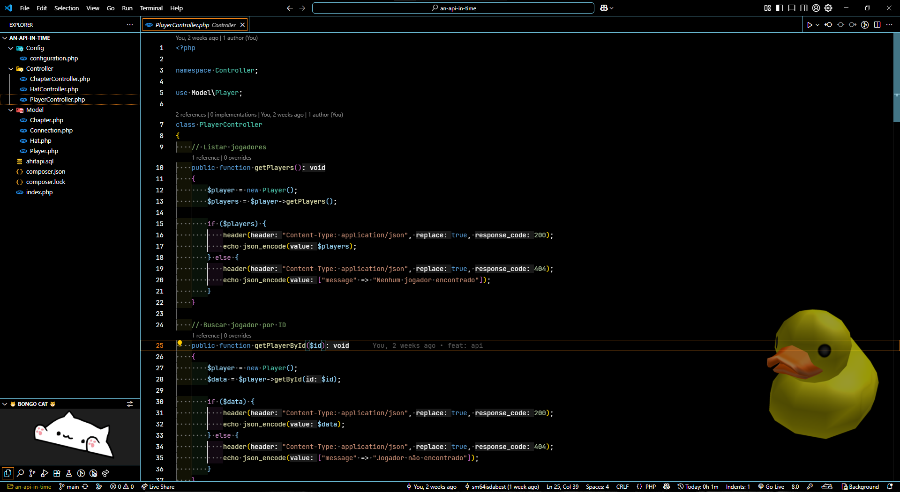

<h1 align="center"> SM64's VSCode Settings </h1>  
  
<p align="center">
  <a href="#extensions">Extensions</a>&nbsp;&nbsp;&nbsp;|&nbsp;&nbsp;&nbsp;  
  <a href="#theme">Theme</a>&nbsp;&nbsp;&nbsp;|&nbsp;&nbsp;&nbsp;  
  <a href="#font">Font</a>
</p>

<p align="center">
  
</p>

### Extensions:
- [Bongo Cat](https://marketplace.visualstudio.com/items?itemName=pixl-garden.BongoCat)
- [Code Runner](https://marketplace.visualstudio.com/items?itemName=formulahendry.code-runner)
- [Composer](https://marketplace.visualstudio.com/items?itemName=DEVSENSE.composer-php-vscode)
- [Cucumber (Gherkin) Full Support](https://marketplace.visualstudio.com/items?itemName=alexkrechik.cucumberautocomplete)
- [Error Lens](https://marketplace.visualstudio.com/items?itemName=usernamehw.errorlens)
- [Git History](https://marketplace.visualstudio.com/items?itemName=donjayamanne.githistory)
- [GitHub Copilot](https://marketplace.visualstudio.com/items?itemName=GitHub.copilot)
- [GitHub Copilot Chat](https://marketplace.visualstudio.com/items?itemName=GitHub.copilot-chat)
- [GitHub Pull Requests](https://marketplace.visualstudio.com/items?itemName=GitHub.vscode-pull-request-github)
- [gitignore](https://marketplace.visualstudio.com/items?itemName=codezombiech.gitignore)
- [GitLens — Git supercharged](https://marketplace.visualstudio.com/items?itemName=eamodio.gitlens)
- [GlassIt-VSC](https://marketplace.visualstudio.com/items?itemName=s-nlf-fh.glassit)
- [indent-rainbow](https://marketplace.visualstudio.com/items?itemName=oderwat.indent-rainbow)
- [IntelliPHP - AI Autocomplete for PHP](https://marketplace.visualstudio.com/items?itemName=DEVSENSE.intelli-php-vscode)
- [Live Preview](https://marketplace.visualstudio.com/items?itemName=ms-vscode.live-server)
- [Live Server](https://marketplace.visualstudio.com/items?itemName=ritwickdey.LiveServer)
- [Live Share](https://marketplace.visualstudio.com/items?itemName=MS-vsliveshare.vsliveshare)
- [Markdown All in One](https://marketplace.visualstudio.com/items?itemName=yzhang.markdown-all-in-one)
- [Material Icon Theme](https://marketplace.visualstudio.com/items?itemName=PKief.material-icon-theme)
- [PHP](https://marketplace.visualstudio.com/items?itemName=DEVSENSE.phptools-vscode)
- [PHP Profiler](https://marketplace.visualstudio.com/items?itemName=DEVSENSE.profiler-php-vscode)
- [WakaTime](https://marketplace.visualstudio.com/items?itemName=WakaTime.vscode-wakatime)
- [Where Am I?](https://marketplace.visualstudio.com/items?itemName=antfu.where-am-i)

### Theme:
- **Dark Modern** *Default Dark Modern*  
  *(GlassIt-VSC extension makes the editor transparent)*

### Font:
- [JetBrains Mono](https://www.jetbrains.com/lp/mono/)

Once installed, make sure to unzip it and open this file:  
```JetBrainsMono-2.304/fonts/ttf/JetBrainsMono-Regular.ttf```